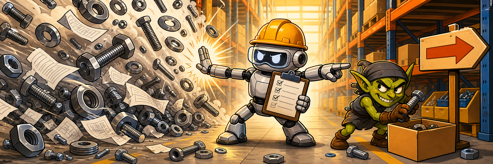

<div align="center">



# Caldura

Sales request intake for messy fastener and MRO orders.

[](https://shanghai-gilt.vercel.app/)
[](#source-access)
[](https://shanghai-gilt.vercel.app/)

[Live Demo](https://shanghai-gilt.vercel.app/) | [Method](#method) | [Try It](#try-it) | [Why It Exists](#why-it-exists)

</div>

---

## What Is Caldura?

Caldura is a risk-controlled sales intake demo for industrial catalog workflows.

It takes the kind of request a salesperson actually gets:

```text
Need 25 M8 flat washers, same as last time.
Also 10 stainless bolts for a bike bottle cage.
```

Then it turns that into structured line items, catalog candidates, confidence signals, and a decision:

```text
customer request -> line items -> candidate matches -> validation gate -> response or sales review
```

The point is not "search box returns something." The point is "do not confidently sell the wrong thing."

## Live Demo

Open the deployed demo:

https://shanghai-gilt.vercel.app/

No login required for the public seeded demo.

## Why It Exists

Sales order automation has a nasty failure mode: the model finds a plausible SKU, sounds confident, and creates a real operational mess.

Fastener and MRO requests are especially easy to misread:

- Thread, length, finish, grade, and material all matter.
- Customers use shorthand, partial specs, and job-context language.
- "Same as last time" can be useful, but only if treated as evidence, not magic.
- Near matches can be worse than no match.
- Some requests need guidance, not a generic stocked SKU.

Caldura is built around that reality. If confidence is weak or attributes are risky, it routes to review instead of pretending.

## Method

Caldura follows a validation-first workflow:

1. Extract requested line items and quantities from free-form text.
2. Match each line against likely catalog candidates.
3. Use customer context when it helps clarify intent.
4. Detect risky missing attributes and contradictions.
5. Decide whether the request can move forward or needs sales review.

Raw match quality is not enough. The useful metric is effective shipped accuracy: how often the system avoids sending a wrong recommendation to the buyer.

### Decision Model

| Outcome | Meaning |
|---|---|
| Ready to order | Strong match, no important blockers, safe to draft a response. |
| Sales review | Plausible match exists, but missing or conflicting details make automation risky. |
| Guidance only | Request is better answered with clarification or repair guidance than a stocked SKU. |

### Repair-Context Layer

Customers do not always know the part name. They often know the job:

- `bike bottle cage bolts stainless`
- `boat hatch screws rusted from saltwater`
- `IKEA missing bed frame bolts`
- `same screws we used for pump guard`
- `screws for bottom of MacBook Pro`

Caldura treats those as repair-context searches. Some can map to normal catalog language. Some need warnings. Some should not return a generic SKU at all.

## Try It

Use the demo with prompts like:

```text
10 pcs 1/4-20 hex cap screw zinc
25 M8 steel flat washers
```

```text
same washers as last time
```

```text
boat hatch screws rusted from saltwater
```

```text
screws for bottom of MacBook Pro
```

Watch for the important part: Caldura does not always try to "win" by returning a SKU. Sometimes the correct answer is review.

## What It Demonstrates

- Free-form RFQ and pasted-email intake.
- Top candidate generation for catalog-style requests.
- Customer-context influence without letting history override explicit request facts.
- Review routing for ambiguous, incomplete, or high-risk requests.
- Preview-only customer email and internal escalation drafts.
- Seeded demo data for showing the workflow without exposing production systems.

## Product Philosophy

Short version, Caveman style:

```text
Wrong bolt bad.
Confident wrong bolt very bad.
Review gate save deal.
```

Longer version: automation should be allowed to say "I know enough" only when it has evidence. Otherwise it should preserve momentum by drafting the right internal next step.

The README structure borrows from the best parts of high-signal technical READMEs like [jcode](https://github.com/1jehuang/jcode): show the demo early, explain the method clearly, make claims concrete, and skip setup noise when the source is not public.

## Source Access

This public repository is intentionally README-only.

The implementation source is private. That protects the code while keeping the project, live demo, and method visible.

## Status

Caldura is a demo project, not a public package. The deployed version is safe to evaluate with seeded data and preview-only workflows.

If you want to see what it does, use the live demo. If you want to copy the code, goblin denied.
